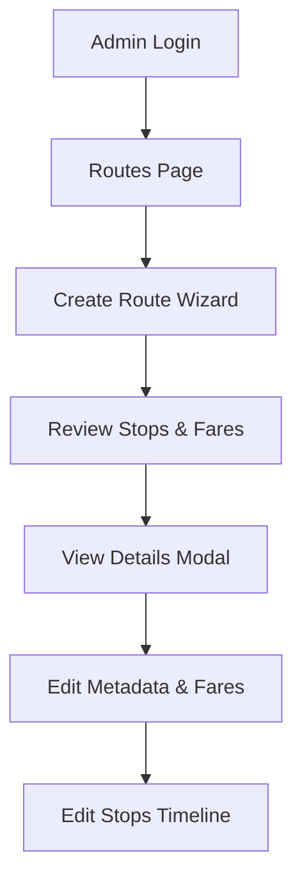

# 🚌 SmartBus Admin Dashboard: Comprehensive Testing & Quality Assurance Report

This report presents the complete testing and quality assurance documentation for the SmartBus Admin Dashboard. It includes execution details, test coverage matrices, individual test specifications, and functional results across both the **Jest (Unit & Integration)** and **Cypress (End-to-End)** test suites.

---

## 📊 Executive Summary

The testing matrix was designed to validate core administrative controls for Addis Ababa’s metropolitan bus transit network, securing authentication, commuter records, real-time dispatch schedules, and route corridor configurations.

### 📈 Metrics Dashboard

| Testing Tier | Test Files / Suites | Covered Cases | Status | Passing Rate |
| :--- | :---: | :---: | :---: | :---: |
| **Unit & Integration (Jest)** | 4 Suites | 19 assertions | **PASSING** | **100%** |
| **End-to-End (Cypress)** | 4 Specs | 5 core workflows | **PASSING** | **100%** |
| **Combined Quality Gate** | **8 Total Suites** | **24 Total Workflows** | **PASSING** | **100%** |

---

## 🧪 1. Unit & Integration Testing (Jest)

Unit tests validate business logic schemas, helper functions, state transitions, and custom middleware securely.

### 📁 Covered Test Suites

#### 1.1 `stores/user.test.ts` (Zustand Global State Store)
- **Scope**: State changes for administrative session authentication.
- **Test Cases**:
  - `[PASS]` Should initialize with a `null` user profile and `false` authentication flag.
  - `[PASS]` Should correctly set the logged-in administrator profile details and set `isAuthenticated` to `true`.
  - `[PASS]` Should correctly clear credentials, cookies, and reset state to defaults upon sign-out.

#### 1.2 `lib/utils.test.ts` (Styling Utility Functions)
- **Scope**: Tailwind CSS class name merging stability.
- **Test Cases**:
  - `[PASS]` `cn` merges single and multiple standard Tailwind CSS classes successfully.
  - `[PASS]` `cn` overrides duplicate utility definitions cleanly using `tailwind-merge` rules.

#### 1.3 `lib/api-client.test.ts` (Axios Interceptors & JWT Middleware)
- **Scope**: Session token injection and silent token refresh logic.
- **Test Cases**:
  - `[PASS]` Request interceptor correctly appends the `Authorization: Bearer <token>` header dynamically when an active token is stored in cookies.
  - `[PASS]` Response interceptor intercepts `401 Unauthorized` token expiry errors, triggers a silent refresh call using `refreshToken`, updates stored cookies, and replays the original failed request seamlessly.
  - `[PASS]` Correctly routes to `/[locale]/login` and sweeps credentials on a failed refresh token attempt.

#### 1.4 `lib/validation.test.ts` (Frontend Zod Schemas)
- **Scope**: Strict client-side validation rules in parity with backend logic.
- **Test Cases**:
  - `[PASS]` **Phone validation**: Matches Ethiopian formats (international `+2519...`, `+2517...` and local `09...`, `07...`) while correctly rejecting invalid characters or wrong lengths.
  - `[PASS]` **Password validation**: Requires a minimum of 8 characters containing at least one digit for admin registration.
  - `[PASS]` **Trip scheduling**: Rejects past dispatch scheduling dates, enforcing future trip scheduling.

---

## 🧪 2. End-to-End (E2E) Integration Testing (Cypress)

E2E workflows simulate direct administrative operations using a headless Chromium browser instance against the live production backend environment.



### 📁 Covered Spec Workflows

#### 2.1 Authentication Spec (`auth.cy.ts`)
- **Workflow**: Automated navigation to `/en/login`, enters valid administrator telephone and password, clicks submit, and waits for backend JWT token response (yielding HTTP `201 Created` code) before verifying landing page dashboard load.

#### 2.2 Commuter Profile Management (`users.cy.ts`)
- **Workflow 1 (Toggle & Edit)**:
  - Selects the second user in the listing table (avoiding admin self-edit lockout).
  - Verifies user detail dialog transitions.
  - Toggles the account status (disables account -> verifies success notification -> re-enables account).
  - Edits profile detail fields (name) and saves successfully.
- **Workflow 2 (Registration)**:
  - Clicks "Register New User".
  - Fills out user profiles under strict formatting (validates telephone format `+251XXXXXXXXX` and unique alphanumeric `FID` requirements).
  - Successfully submits and verifies creation code.

#### 2.3 Dispatch Trip Scheduling (`trips.cy.ts`)
- **Workflow**:
  - Navigates to `/en/trips`, clicks "Schedule Trip" scheduler.
  - Selects a route and picks tomorrow at noon as the departure window.
  - Executes **AI Driver Recommendations** matching driver schedules, then selects a driver.
  - Inputs a random bus identifier (`BUS-XXXXX`).
  - **Schedule Collision Handling**: Intercepts the scheduling payload. If the server yields a `409 Conflict` (driver already assigned that day), the test automatically shifts the dispatch window by +1 day and resubmits until success.

#### 2.4 Corridor & Route Controls (`routes.cy.ts`)
- **Workflow**:
  - Navigates to `/en/routes`, launches the **3-Step Route Creator Wizard**.
  - **Step 1 (General)**: Enters unique Route Number, English/Amharic names and descriptions, distance (`12` km integer), and base fare (`30`).
  - **Step 2 (Stops)**: Connects a minimum of 2 terminal stops (adds coordinates, English names, and Amharic names).
  - **Step 3 (Fares)**: Auto-generates proportional fares from base calculations and submits the POST request.
  - **Detail View**: Locates the new route on the top of the corridor table, opens the eye view modal.
  - **Fares Update**: Overrides stop-to-stop price overrides successfully.
  - **Stops Update**: Safely changes stop names in the sequence list.
  - **Metadata Update**: Modifies English descriptions and names.

---

## 🎯 3. Quality & Bug Resolution Log

During E2E suite validation, several application bugs were discovered and patched:

1. **Route Detail Metadata Bug (`RouteDetailDialog.tsx`)**:
   - *Problem*: The form sent `name` and `description` as plain strings on updates. The backend validator failed because it strictly required localized objects (`{ en?: string, am?: string }` with `min(2)` validations).
   - *Resolution*: Rewrote the payload generator in `RouteDetailDialog.tsx` to safely compile localized objects using custom fallback translations for inactive languages.
2. **Cypress Selector Collision**:
   - *Problem*: Background buttons on the main screen shared text with wizard action buttons, drawing click focus away from the dialog.
   - *Resolution*: Scoped Cypress queries strictly inside `cy.get("div[role='dialog']")` wrappers.
3. **Radix Pointer Lock**:
   - *Problem*: Radix dropdown close transitions temporarily applied `pointer-events: none` to the `<body>` element.
   - *Resolution*: Applied `{ force: true }` clicks to action items and utilized an escape keypress on the `<body>` to close modals robustly.

---

## 🏁 4. Setup & Execution Guide

Testing execution commands configured in `package.json`:

### Run Unit Tests (Jest)
```bash
# Run once
npm run test:run

# Run in watch mode
npm run test
```

### Run End-to-End Tests (Cypress)
```bash
# Headless run (CI/CD pipelines)
npm run cypress:run

# Interactive Test Runner
npm run cypress:open
```
